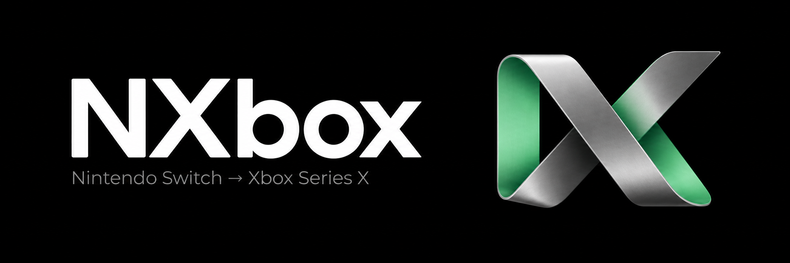

<!--
SPDX-FileCopyrightText: Copyright 2025 Eden Emulator Project
SPDX-FileCopyrightText: 2018 yuzu Emulator Project
SPDX-License-Identifier: GPL-3.0-or-later
-->



# NXbox

An experimental Nintendo Switch emulator port for **Xbox Series X**. Built on Eden, with a
controller-first, minimal-setup experience as its goal.

[Development status](docs/nxbox-port.md) ·
[Build workflow](https://github.com/NspxMiguel/NXbox/actions/workflows/build-nxbox.yml) ·
[Source provenance](#credits-and-lineage) · [License](LICENSE.txt)

> **Early development. No playable Xbox release is available.** The original homebrew boots, runs at
> 45 to 60 FPS on a Series X, responds to controller input and exits cleanly. A user-owned
> commercial game (Persona 5 Royal) now boots and presents frames at a steady 30 FPS (its own
> frame cap, 100% emulation speed) for the first minutes measured; it has not been played
> through, so no compatibility is claimed.

## Where it stands

Results below were measured on an Xbox Series X in Dev Mode.

| Area                     | Current state                                                                                                                        |
| ------------------------ | ------------------------------------------------------------------------------------------------------------------------------------ |
| CPU (Dynarmic JIT)       | Original ARM64 homebrew executed and shut down cleanly on Xbox                                                                       |
| Guest memory             | 4 GiB page table committed on demand; sparse probe passed on Xbox                                                                    |
| OpenGL on D3D12 (Mesa)   | OpenGL 4.6 clear, presentation and compute readback passed on Xbox                                                                   |
| Worker-thread GL context | Patched Mesa passed a shared-context compute test on Xbox                                                                            |
| Homebrew boot            | Initializes all services, connects the Xbox controller, reaches its ready state                                                      |
| Game rendering           | Homebrew presents 45 to 60 FPS on Xbox (2 minute run); a commercial game presents 30 FPS at 100% speed in a short boot run ([notes](docs/nxbox-port.md)) |
| Game input               | Remote A and Plus reach the guest and exit cleanly (homebrew); not yet exercised with a physical pad                                 |
| Audio                    | Not implemented on Xbox (null backend)                                                                                               |
| Game compatibility       | Unverified; no full-library compatibility claim                                                                                      |

The standalone probe presented about 60 clear frames per second. That is the driver's presentation
rate, **not** game performance. No game FPS has been measured.

## The experience we are building

- A game library designed for the Xbox controller.
- Guided, one-time import of user-provided content and required configuration.
- Per-game mod management and save preservation across updates.
- Upscaling options: inherited FSR 1 code, with newer techniques under investigation.
- Useful diagnostics and conservative defaults that reduce manual tweaking.

These are development goals. FSR 2/3, frame generation, and commercial-game support are **not
implemented or validated on Xbox**. Compatibility will be reported per title.

## Development

Follow the [port notes and validation gates](docs/nxbox-port.md) and
[UWP build setup](docs/uwp_build.md). The root build requires CMake 3.31 or newer.

The standalone memory-policy checks can run without the emulator dependency graph:

```sh
cmake -S tests/port -B build-port-tests
cmake --build build-port-tests --config Release --parallel 2
ctest --test-dir build-port-tests -C Release --output-on-failure
```

NXbox does not bundle games, firmware, or decryption keys. Development artifacts are experimental
and are not playable releases.

## Credits and lineage

**NXbox is a fork, not an emulator written from scratch.**

- [Eden](https://git.eden-emu.dev/eden-emu/eden) provides the emulator foundation.
- [juanresendiz813/eden-xbox](https://github.com/juanresendiz813/eden-xbox) provides the starting
  Xbox/UWP work, including the imported boot frontend.
- The **Yuzu** and **Sudachi** projects and their contributors built the earlier foundations from
  which Eden derives.
- Third-party libraries retain their own licenses and copyright notices.

Exact source revisions are recorded in the [provenance notes](docs/nxbox-port.md#source-provenance).
NXbox is an independent project and does not imply endorsement by its upstream projects, Nintendo,
or Microsoft. The cover artwork was created for NXbox.

## License

GNU GPL version 3 or later; see [LICENSE.txt](LICENSE.txt). Existing source notices and third-party
licenses are retained.
