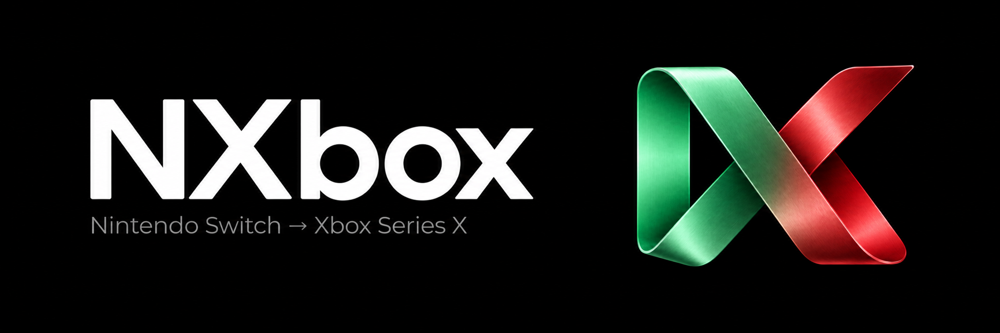
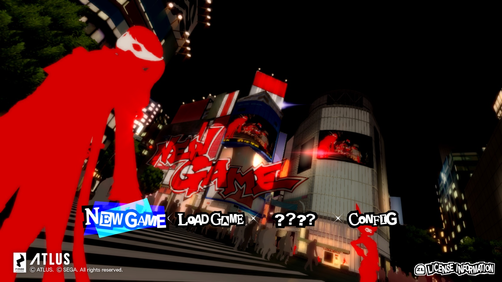
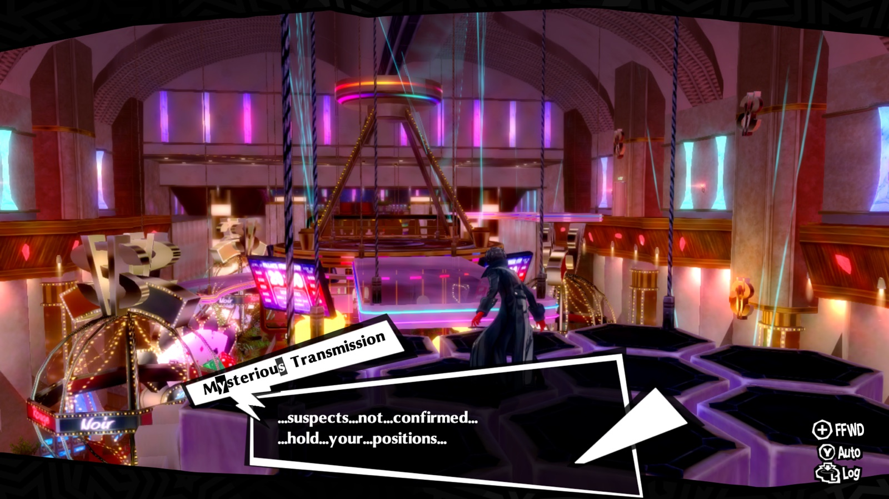
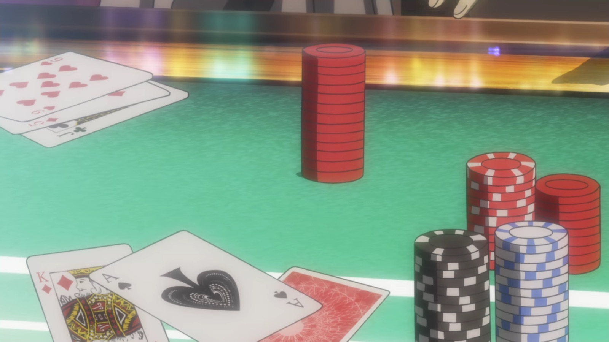
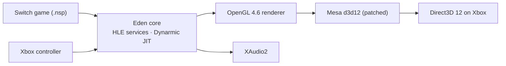

<!--
SPDX-FileCopyrightText: Copyright 2025 Eden Emulator Project
SPDX-FileCopyrightText: 2018 yuzu Emulator Project
SPDX-License-Identifier: GPL-3.0-or-later
-->



# NXbox

**A Nintendo Switch emulator that runs natively on an Xbox Series X.** NXbox is a port of the
[Eden](https://git.eden-emu.dev/eden-emu/eden) emulator to the Xbox's UWP sandbox: the Switch's
ARM64 code runs through a JIT, and its graphics go through OpenGL on Direct3D 12.

[Status](#where-it-stands) · [How it works](#how-it-works) · [Port notes](docs/nxbox-port.md) ·
[Builds](https://github.com/NspxMiguel/NXbox/actions/workflows/build-nxbox.yml) ·
[Credits](#credits-and-lineage) · [License](LICENSE.txt)

<table>
  <tr>
    <td></td>
    <td></td>
  </tr>
  <tr>
    <td></td>
    <td>
      <b>Persona 5 Royal, on an Xbox Series X.</b><br><br>
      It boots, plays its cutscenes and reaches the first playable area (the casino), with
      audio. It still stutters on loads and has bugs: <b>no game is fully playable yet</b>.<br><br>
      Captured from the console with NXbox, using a copy of the game the owner bought. NXbox
      ships no games, firmware or keys.
    </td>
  </tr>
</table>

> **Experimental. No game is 100% playable without bugs yet.** Persona 5 Royal opens and reaches
> gameplay on a console in Developer Mode, but booting is not the same as working well: it still
> stutters on loads and has open bugs. There is no compatibility list, no setup screen yet, and no
> public release: builds come from CI.

## Where it stands

Everything below was measured on a retail Xbox Series X in Developer Mode.

| Area | State |
| --- | --- |
| CPU | Switch ARM64 code runs through the Dynarmic JIT inside the UWP sandbox, with a 128 MiB code cache |
| Graphics | OpenGL 4.6 on Direct3D 12 through a patched Mesa `d3d12` driver, built in CI |
| Frame pacing | 30 FPS in the stretches measured (worst frame gap 36–64 ms in the casino), but loads still freeze the picture for up to a few seconds |
| Shaders | Per-title pipeline cache, precompiled at boot so scene changes do not compile shaders. A cache can be shared between consoles over the LAN |
| Memory | Guest memory is committed on demand. Persona 5 Royal peaks around 4.0 GB of the 5 GiB app budget |
| Audio | XAudio2 output |
| Movies | Decoded on the CPU with FFmpeg |
| Textures | ASTC decoded on the CPU. The GPU decoder is being fixed for D3D12 |
| Input | Xbox controller, mapped to a Pro Controller |
| Compatibility | No game is fully playable yet. Persona 5 Royal boots and reaches gameplay with stutters and bugs; nothing else has been tested yet |

The hard parts so far, each found on the console and written up in the [port notes](docs/nxbox-port.md):

- **Black screen for weeks**: Mesa's D3D12 driver began a pipeline-statistics query twice, so every
  command list failed to close and no GPU work ever ran. A known-color readback self-test exposed it.
- **Out of memory at 5 GiB**: the kernel zeroed guest memory with `memset`, committing the whole heap.
  On Xbox it now decommits pages instead.
- **Stutter at every scene change**: shaders compiled on first use. The pipeline cache is now
  precompiled on the renderer's own context, because a second GL context cannot be created on Mesa
  under UWP.
- **System starvation**: FFmpeg's default thread count starved the console's own services until the
  Device Portal stopped answering. It is now capped.

## How it works


```mermaid
flowchart LR
    game["Switch game (.nsp)"] --> core["Eden core<br/>HLE services · Dynarmic JIT"]
    core --> gl["OpenGL 4.6 renderer"]
    gl --> mesa["Mesa d3d12 (patched)"]
    mesa --> d3d["Direct3D 12 on Xbox"]
    core --> audio["XAudio2"]
    pad["Xbox controller"] --> core
```

- `src/eden_uwp/`: the Xbox frontend. It boots the game, owns the window and the controller, and
  writes `eden_uwp_diag.txt` with frame pacing, memory and stall attribution.
- `tools/nxbox/patch_mesa_uwp.py`: the Mesa patches, applied to a pinned
  [aerisarn/mesa-uwp](https://github.com/aerisarn/mesa-uwp) in CI.
- `tools/shader-share/`: a small server that keeps the largest valid shader cache per title.

## Trying it

You need an Xbox Series X|S in **Developer Mode** and your own dumps:

1. Install a package from the
   [package workflow](https://github.com/NspxMiguel/NXbox/actions/workflows/package-nxbox.yml)
   through the Device Portal.
2. Put `prod.keys` and `title.keys` in the app's `LocalState\eden\keys`.
3. Put your games (`.nsp`, `.nsz` or `.xci`) in `LocalState\games`, or on a USB drive in
   `NXbox\games` (the console's internal developer storage is small, a few GB). `.nsz` files are
   converted on the console the first time the library sees them.
4. Launch NXbox from the dashboard and pick the game in the library.

Two newer ways to get games in are built but not yet tested on the console: **Add games** imports
games and keys from a USB drive (copy to the console, or move into `NXbox\games` to play from the
drive), and **Settings → Sources** browses and downloads from Tinfoil-format sources you add
yourself (none are included).

Details and the diagnostic switches are in the [port notes](docs/nxbox-port.md#booting-a-game-from-localstate-2026-09-25).
NXbox does not bundle games, firmware or decryption keys, and never will.

## Development

Read the [port notes](docs/nxbox-port.md) and the [UWP build setup](docs/uwp_build.md). The root
build requires CMake 3.31 or newer. The standalone memory-policy checks run without the emulator's
dependency graph:

```sh
cmake -S tests/port -B build-port-tests
cmake --build build-port-tests --config Release --parallel 2
ctest --test-dir build-port-tests -C Release --output-on-failure
```

## Credits and lineage

**NXbox is a fork, not an emulator written from scratch.**

- [Eden](https://git.eden-emu.dev/eden-emu/eden) provides the emulator.
- [juanresendiz813/eden-xbox](https://github.com/juanresendiz813/eden-xbox) provided the starting
  Xbox/UWP work, including the imported boot frontend.
- [aerisarn/mesa-uwp](https://github.com/aerisarn/mesa-uwp) provides Mesa for UWP.
- The **yuzu** and **Sudachi** projects and their contributors built the foundations Eden derives
  from.
- Third-party libraries keep their own licenses and copyright notices.

Exact source revisions are recorded in the [provenance notes](docs/nxbox-port.md#source-provenance).
NXbox is an independent project. It is not affiliated with or endorsed by its upstream projects,
Nintendo, Microsoft, Atlus or SEGA. The artwork was created for NXbox.

## License

GNU GPL version 3 or later; see [LICENSE.txt](LICENSE.txt). Existing source notices and third-party
licenses are kept.
