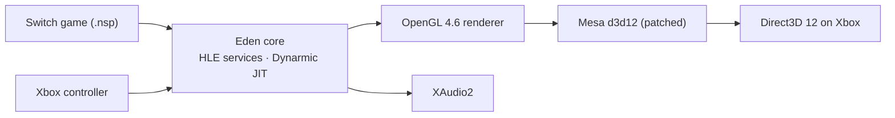

<!--
SPDX-FileCopyrightText: Copyright 2025 Eden Emulator Project
SPDX-FileCopyrightText: 2018 yuzu Emulator Project
SPDX-License-Identifier: GPL-3.0-or-later
-->

<p align="center">
  
</p>

<h1 align="center">NXbox</h1>

<p align="center">
  <b>A Nintendo Switch emulator that runs natively on an Xbox Series X.</b><br>
  A port of <a href="https://git.eden-emu.dev/eden-emu/eden">Eden</a> to the Xbox UWP sandbox: the Switch's ARM64 code runs
  through a JIT, and its graphics go through OpenGL on Direct3D 12.
</p>

<p align="center">
  <a href="LICENSE.txt"></a>
  
  
  <a href="https://github.com/NspxMiguel/NXbox/actions/workflows/build-nxbox.yml"></a>
  <a href="https://github.com/NspxMiguel/NXbox/actions/workflows/port-tests.yml"></a>
</p>

<p align="center">
  <a href="#where-it-stands">Status</a> ·
  <a href="#what-to-expect">What to expect</a> ·
  <a href="#how-it-works">How it works</a> ·
  <a href="#trying-it">Trying it</a> ·
  <a href="#development">Development</a> ·
  <a href="#credits-and-lineage">Credits</a> ·
  <a href="docs/nxbox-port.md">Port notes</a>
</p>

<!-- Donation address: change it here and in "Support the project" only. -->
<p align="center">
  <a href="#support-the-project"></a><br>
  <sub><code>bc1qm64el0gp0kvk7zqhl89x0vkngu2skqxd26vpjg</code></sub>
</p>

<table>
  <tr>
    <td></td>
    <td></td>
  </tr>
  <tr>
    <td></td>
    <td>
      <b>Persona 5 Royal, on an Xbox Series X.</b><br><br>
      It boots, plays its cutscenes and reaches the first playable area (the casino), with
      audio. It still stutters on loads and has bugs: <b>no game is fully playable yet</b>.<br><br>
      Captured from the console with NXbox, using a copy of the game the owner bought. NXbox
      ships no games, firmware or keys.
    </td>
  </tr>
</table>

> **Experimental. No game is 100% playable without bugs yet.** Persona 5 Royal opens and reaches
> gameplay on a console in Developer Mode, but booting is not the same as working well: it still
> stutters on loads and has open bugs. There is no compatibility list, no setup screen yet, and no
> public release: builds come from CI.

## Where it stands

Everything below was measured on a retail Xbox Series X in Developer Mode.

| Area | State |
| --- | --- |
| CPU | Switch ARM64 code runs through the Dynarmic JIT inside the UWP sandbox, with a 128 MiB code cache |
| Graphics | OpenGL 4.6 on Direct3D 12 through a patched Mesa `d3d12` driver, built in CI |
| Frame pacing | 30 FPS in the stretches measured (worst frame gap 36–64 ms in the casino), but loads still freeze the picture for up to a few seconds |
| Shaders | Per-title pipeline cache, precompiled at boot so scene changes do not compile shaders. A cache can be shared between consoles over the LAN |
| Memory | Guest memory is committed on demand. Persona 5 Royal peaks around 4.0 GB of the 5 GiB app budget |
| Audio | XAudio2 output |
| Movies | Decoded on the CPU with FFmpeg |
| Textures | ASTC decoded on the CPU. The GPU decoder is being fixed for D3D12 |
| Input | Xbox controller, mapped to a Pro Controller |
| Compatibility | No game is playable. Persona 5 Royal is the closest: it boots and reaches gameplay, with serious bugs. Breath of the Wild and Mario Kart 8 Deluxe boot and submit frames, but I have not confirmed that the picture is correct, and both lose the GPU after a few minutes. Super Mario 3D World boots, with menus and gameplay that do not render correctly |

<details>
<summary><b>The hard parts so far</b>, each found on the console</summary>

- **Black screen for weeks**: Mesa's D3D12 driver began a pipeline-statistics query twice, so every
  command list failed to close and no GPU work ever ran. A known-color readback self-test exposed it.
- **Out of memory at 5 GiB**: the kernel zeroed guest memory with `memset`, committing the whole heap.
  On Xbox it now decommits pages instead.
- **Stutter at every scene change**: shaders compiled on first use. The pipeline cache is now
  precompiled on the renderer's own context, because a second GL context cannot be created on Mesa
  under UWP.
- **System starvation**: FFmpeg's default thread count starved the console's own services until the
  Device Portal stopped answering. It is now capped.

Written up in the [port notes](docs/nxbox-port.md).

</details>

## What to expect

- **There is no release date.** Nothing is promised until it is stable; releases will appear on the
  [releases page](https://github.com/NspxMiguel/NXbox/releases) when there is something to try.
- **No game is playable yet.** The table below is the honest state of each target.
- **Current focus: The Legend of Zelda: Breath of the Wild**, at the request of a person who asked
  for it. Super Mario 3D World, Mario Kart 8 Deluxe and Bayonetta wait until it is playable and
  renders without graphical glitches.
- **What is being fixed right now:** Breath of the Wild draws its intro (the Nintendo logo and the
  Zelda title with its lens flare) and then the Direct3D 12 device is removed about two minutes in.
  Two real causes are already fixed: block-compressed texture uploads with unaligned copy boxes,
  and a workaround that was skipping draws and left the picture black. The next cause is still
  being traced.
- **How it is built:** by one person in their spare time, with AI coding tools doing much of the
  hard work on a small budget. Progress comes in bursts, and long waits are usually tool limits.
- **What you need:** an Xbox in Developer Mode, and your own game dumps, firmware and keys.
  NXbox ships none of them.
- **Asking for a game:** open an issue naming the title and version you own. Games the maintainer
  can buy and test move faster.

## Compatibility

Measured on a retail Xbox Series X in Developer Mode, with copies of the games the maintainer owns.
"Playable" means someone can play it from start to finish without graphical or stability problems:
nothing is there yet.

| Game | State | What happens |
| --- | --- | --- |
| The Legend of Zelda: Breath of the Wild | **In focus**, not playable | Boots and draws its intro (Nintendo logo, Zelda title, lens flare), then the GPU is lost about two minutes in, before the title screen is usable |
| Persona 5 Royal | Not playable | The closest: boots, plays cutscenes and reaches the first playable area, with audio, but it still stutters on loads and has serious bugs |
| Mario Kart 8 Deluxe | Not playable | Boots, then the GPU is lost after under a minute; the picture has not been checked |
| Super Mario 3D World | Not playable | Boots; menus and gameplay do not render correctly |
| Bayonetta | Not tested | Planned after Breath of the Wild |

## How it works


```mermaid
flowchart LR
    game["Switch game (.nsp)"] --> core["Eden core<br/>HLE services · Dynarmic JIT"]
    core --> gl["OpenGL 4.6 renderer"]
    gl --> mesa["Mesa d3d12 (patched)"]
    mesa --> d3d["Direct3D 12 on Xbox"]
    core --> audio["XAudio2"]
    pad["Xbox controller"] --> core
```

- `src/eden_uwp/`: the Xbox frontend. It boots the game, owns the window and the controller, and
  writes `eden_uwp_diag.txt` with frame pacing, memory and stall attribution.
- `tools/nxbox/patch_mesa_uwp.py`: the Mesa patches, applied to a pinned
  [aerisarn/mesa-uwp](https://github.com/aerisarn/mesa-uwp) in CI.
- `tools/shader-share/`: a small server that keeps the largest valid shader cache per title.

## Trying it

You need an Xbox Series X|S in **Developer Mode** and your own dumps:

1. Install a package from the
   [package workflow](https://github.com/NspxMiguel/NXbox/actions/workflows/package-nxbox.yml)
   through the Device Portal.
2. Put `prod.keys` and `title.keys` in the app's `LocalState\eden\keys`.
3. Put your games (`.nsp`, `.nsz` or `.xci`) in `LocalState\games`, or on a USB drive in
   `NXbox\games` (the console's internal developer storage is small, a few GB). `.nsz` files are
   converted on the console the first time the library sees them.
4. Launch NXbox from the dashboard and pick the game in the library.

Two newer ways to get games in are built but not yet tested on the console: **Add games** imports
games and keys from a USB drive (copy to the console, or move into `NXbox\games` to play from the
drive), and **Settings → Sources** browses and downloads from Tinfoil-format sources you add
yourself (none are included).

Details and the diagnostic switches are in the [port notes](docs/nxbox-port.md#booting-a-game-from-localstate-2026-09-25).
NXbox does not bundle games, firmware or decryption keys, and never will.

## Development

Read the [port notes](docs/nxbox-port.md) and the [UWP build setup](docs/uwp_build.md). The root
build requires CMake 3.31 or newer. The standalone memory-policy checks run without the emulator's
dependency graph:

```sh
cmake -S tests/port -B build-port-tests
cmake --build build-port-tests --config Release --parallel 2
ctest --test-dir build-port-tests -C Release --output-on-failure
```

## Support the project

<table>
  <tr>
    <td></td>
    <td>
      
      <b>Bitcoin</b><br>
      <code>bc1qm64el0gp0kvk7zqhl89x0vkngu2skqxd26vpjg</code><br><br>
      Optional. It does not buy a release date or a specific game; it only helps pay for the tools
      that do the work.
    </td>
  </tr>
</table>

## Credits and lineage

**NXbox is a fork, not an emulator written from scratch.**

- [Eden](https://git.eden-emu.dev/eden-emu/eden) provides the emulator.
- [juanresendiz813/eden-xbox](https://github.com/juanresendiz813/eden-xbox) provided the starting
  Xbox/UWP work, including the imported boot frontend.
- [aerisarn/mesa-uwp](https://github.com/aerisarn/mesa-uwp) provides Mesa for UWP.
- The **yuzu** and **Sudachi** projects and their contributors built the foundations Eden derives
  from.
- **Cheats** come from the community database
  [nx-cheats-db](https://github.com/sthetix/nx-cheats-db) by sthetix, reached the way
  [CNX Updater](https://github.com/CostelaCNX/CNX-Updater) by CostelaCNX (GPL-3.0) does. CNX Updater
  is a fork of [AIO-Switch-Updater](https://github.com/HamletDuFromage/aio-switch-updater) by
  HamletDuFromage (GPL-3.0), built on Borealis by natinusala, and their feature set inspired the
  downloads and cheats of NXbox. The data is fetched at runtime and belongs to its authors; see
  [NOTICE.md](NOTICE.md).
- Third-party libraries keep their own licenses and copyright notices.

Exact source revisions are recorded in the [provenance notes](docs/nxbox-port.md#source-provenance).
NXbox is an independent project. It is not affiliated with or endorsed by its upstream projects,
Nintendo, Microsoft, Atlus or SEGA. The artwork was created for NXbox.

## License

GNU GPL version 3 or later; see [LICENSE.txt](LICENSE.txt). Existing source notices and third-party
licenses are kept.
